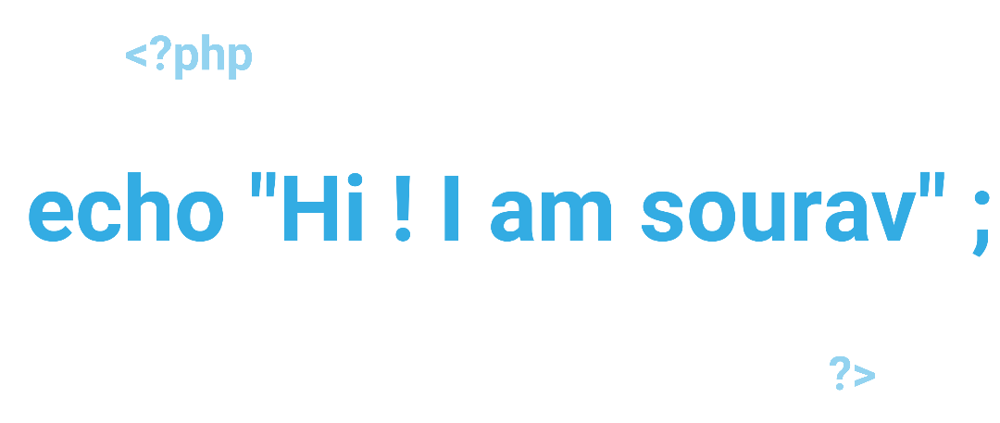

### Hello 👋

# Information: 

Hey, I am web developer 🖥️🖥️🖥️ . Build websites . I Do experimental thing in here . And I love to make website . My passion is to code hard things . In here you can find all type of poject with PHP just just to my website repository . In my account you can get experimental results thing which I created by PHP just for fun and I promote open source coding. Thankyou

### Skills, Programing language:

 

### Socials:

 

# Statues:

- 🔭 I’m currently working on ... building Website
- 🌱 I’m currently learning ... Angular
- 👯 I’m looking to collaborate on ... Anyone who is passionate in building website
- 🤔 I’m looking for help with ... A partner
- 💬 Ask me about ... Anything
- 📫 How to reach me: ... souravmaity091@gmail.com , http://tricksblog.000webhostapp.com, https://stackoverflow.com/users/18915364/sourav-maity, https://g.dev/souravmaity, https://www.linkedin.com/in/sourav-maity-985a01200/
- 😄 Pronouns: ... English , hindi , Bengal
- ⚡ Fun fact: ... Music
 ;-)
